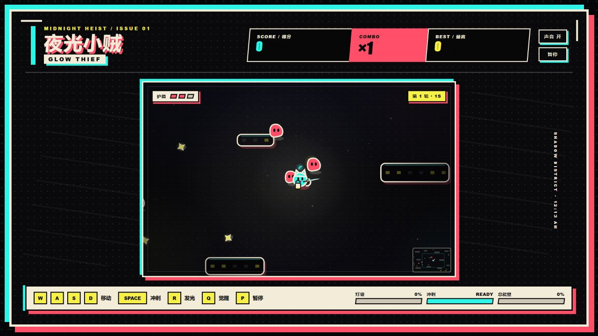
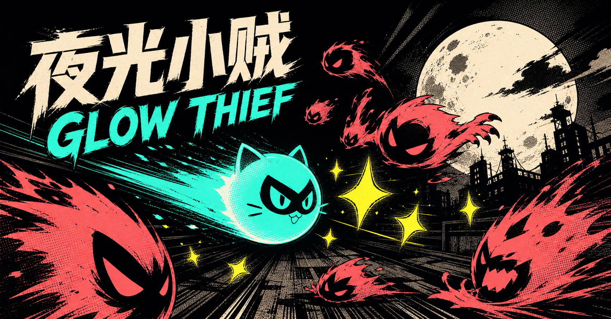

# 夜光小贼 · Glow Thief

一款午夜漫画风的短局制 2D 街机小游戏。收集光点、避开影子，用冲刺击碎敌人并维持连击；积满灯袋后进入发光状态，积满总能量后开启觉醒形态。

> 当前状态：**Alpha / 可游玩原型**。核心循环、键盘与触屏操作、音效、暂停、最高分记录均已实现；关卡内容和平衡仍在迭代。

## 截图



<details>
<summary>宣传图</summary>



</details>

## 游戏玩法

- 收集黄色光点来提高分数、连击、灯袋和觉醒能量。
- 使用冲刺击碎影子。冲刺期间拥有短暂无敌时间。
- 灯袋充满后按 `R` 进入短暂发光状态。
- 总能量充满后按 `Q` 开启觉醒形态。
- 被影子碰到会失去护盾；护盾耗尽后本轮结束。

### 操作

| 动作 | 键盘 | 触屏 |
| --- | --- | --- |
| 移动 | `WASD` 或方向键 | 左侧方向按钮 |
| 冲刺 | `Space` | 冲刺按钮 |
| 发光 | `R` | 发光按钮 |
| 觉醒 | `Q` | 觉醒按钮 |
| 暂停 / 继续 | `P`、`Esc`、`Enter` 或界面按钮 | 界面按钮 |

## 安装与运行

要求：Node.js `>=22.13.0` 和 npm。

```bash
git clone <你的仓库地址>
cd glow-thief
npm ci
npm run dev
```

开发服务器启动后，打开终端中显示的本地地址。生产构建与本地生产启动：

```bash
npm run build
npm start
```

如需部署并生成正确的社交分享绝对地址，可复制 `.env.example` 为 `.env.local`，并设置 `NEXT_PUBLIC_SITE_URL`。本地运行游戏不需要环境变量。

## 开发

- `app/page.tsx`：游戏状态、输入、Canvas 绘制、碰撞、计分与程序化音效。
- `app/globals.css`：界面、响应式布局和触屏控件样式。
- `app/layout.tsx`：页面及社交分享元数据。
- `worker/`、`build/`、`vite.config.ts`：vinext / Cloudflare Worker 构建适配。
- `tests/`：生产构建的服务端渲染冒烟测试。

常用检查：

```bash
npm run lint
npm test
```

### 已知开发 / 构建依赖风险

截至 2026-08-10，`npm audit --omit=dev` 报告 0 个生产依赖漏洞；完整审计仍报告 2 个 high severity 告警，均来自开发 / 构建依赖链 `vinext@0.0.50 → image-size@2.0.2`。当前自动修复会强制降级 vinext，可能破坏现有构建，因此暂不采用。项目不处理用户上传或其他不可信图片；后续升级上游依赖时应重新运行构建、测试和安全审计。详见 [SECURITY.md](./SECURITY.md)。

游戏运行时不需要 API Key 或后端服务。最高分仅保存在浏览器的 `localStorage` 中；音效由 Web Audio API 实时合成，不包含外部音频文件。

## 当前开发状态

已完成：

- 完整的单局游戏循环与难度递增
- 键盘和触屏操作
- 冲刺、发光、觉醒、连击和护盾系统
- 程序化绘制、粒子效果、屏幕震动与程序化音效
- 暂停、静音和本地最高分

仍属原型：游戏平衡、无障碍体验、浏览器兼容范围和内容量尚未达到正式发行标准。

## Roadmap

- [ ] 增加更多敌人行为与场景变化
- [ ] 完善首次游玩引导和可访问性设置
- [ ] 增加可配置的难度与音量选项
- [ ] 扩充自动化测试和多浏览器测试
- [ ] 优化低性能移动设备上的渲染表现
- [ ] 在稳定玩法后发布 `1.0.0`

## 素材与版权

游戏角色、场景与特效由 Canvas 代码实时绘制；音效由 Web Audio API 实时合成；没有打包音乐、第三方字体或角色素材。`public/og.png` 是带 C2PA 来源信息的 OpenAI 生成宣传图。详细来源和使用注意事项见 [ASSETS.md](./ASSETS.md)。

## License

代码以 [MIT License](./LICENSE) 开源。素材适用范围和来源说明见 [ASSETS.md](./ASSETS.md)，第三方开源声明见 [THIRD_PARTY_NOTICES.md](./THIRD_PARTY_NOTICES.md)。
